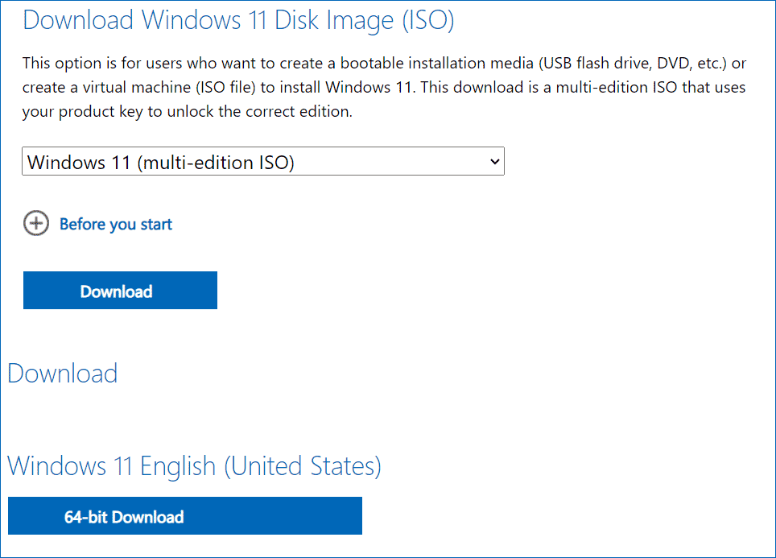
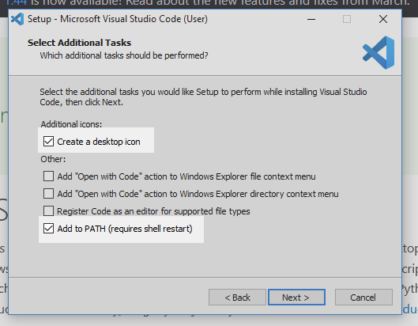
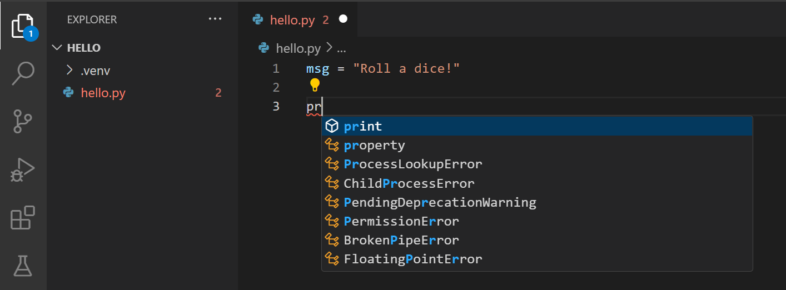
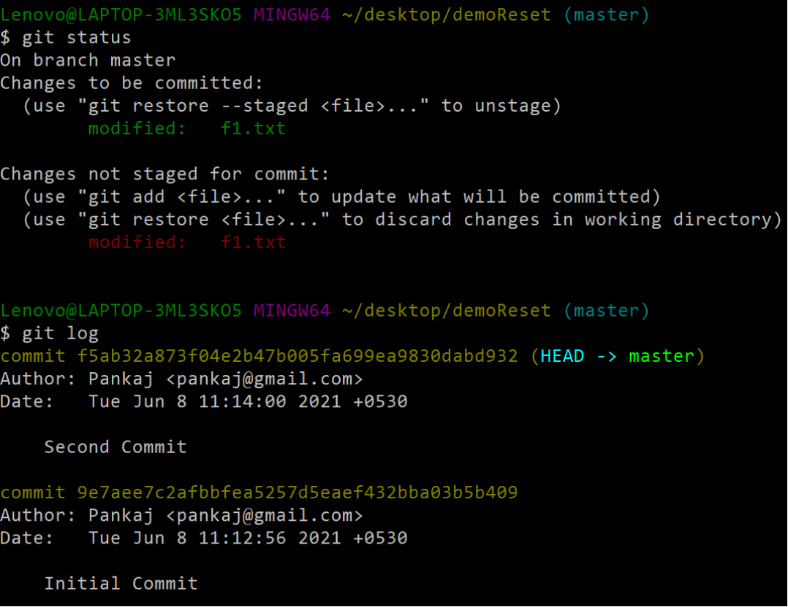
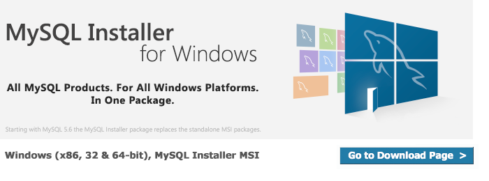
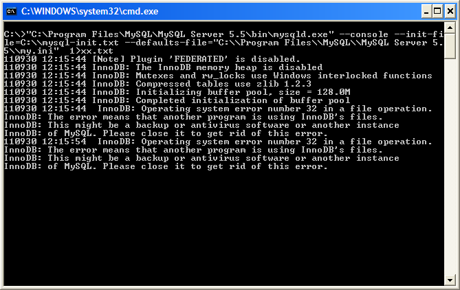
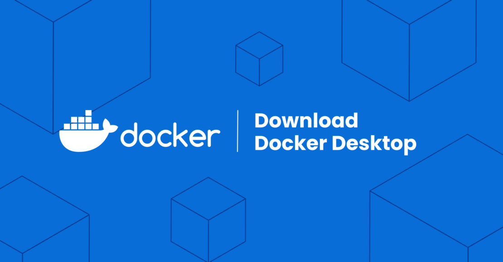
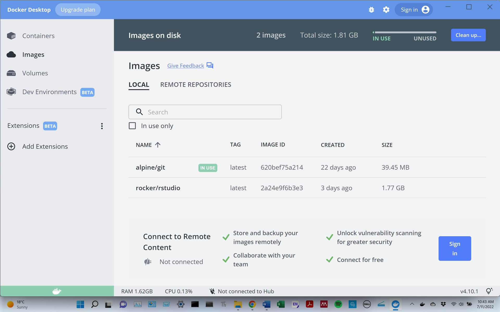

# Dev_Setup
Setup Development Environment

#Assignment: Setting Up Your Developer Environment

#Objective:
This assignment aims to familiarize you with the tools and configurations necessary to set up an efficient developer environment for software engineering projects. Completing this assignment will give you the skills required to set up a robust and productive workspace conducive to coding, debugging, version control, and collaboration.

#Tasks:

1.  Select Your Operating System (OS):
   Choose an operating system that best suits your preferences and project requirements. Download and Install Windows 11. https://www.microsoft.com/software-download/windows11

- Check System Requirements: Ensure that your computer meets the minimum system requirements for Windows 11.
 

- Backup Your Data: Before performing any major operating system installation, it's crucial to back up your important files and data.

- Download Windows 11: You can download the Windows 11 installation files from the official Microsoft website.
- 
- 
- Create Installation Media: If you've downloaded a Windows 11 ISO file, you'll need to create a bootable USB drive or DVD using this ISO.

 
- Boot from Installation Media: Insert the bootable USB drive or DVD into your computer and restart it.

- Install Windows 11: Follow the on-screen instructions to begin the Windows 11 installation process.

- Choose Installation Type: Select the installation type. You can choose to upgrade your existing version of Windows or perform a clean installation. 

- Install Drivers and Updates: After installing Windows 11, it's essential to install drivers for your hardware components.

2. Install a Text Editor or Integrated Development Environment (IDE):
   Select and install a text editor or IDE suitable for your programming languages and workflow. Download and Install Visual Studio Code. https://code.visualstudio.com/Download

   - Download Visual Studio Code: Go to the official Visual Studio Code website.
  
    
   - Run the Installer: Once the download is complete, run the installer by double-clicking on the downloaded file.
 !
  
   - Launch Visual Studio Code: After the installation is complete, you can launch Visual Studio Code by double-clicking its icon on the desktop.
   
    
   - Install Extensions (Optional): Visual Studio Code supports a wide range of extensions that add additional features and functionality. 
 
    
   - Start Coding: Once Visual Studio Code is installed and set up, you're ready to start coding.
   

3. Set Up Version Control System:
   Install Git and configure it on your local machine. Create a GitHub account for hosting your repositories. Initialize a Git repository for your project and make your first commit. https://github.com

Visit the official Git website: Git Downloads.

Once Git is installed, open a terminal or command prompt.
Set your username by entering the following command, replacing "Your Name" with your actual name:

Set your email address by entering the following command, replacing "your.email@example.com" with your actual email address:

Visit the GitHub website: GitHub.
Click on "Sign up" and follow the instructions to create your GitHub account.

Add the files you want to include in the Git repository using the following command:
git add .

This command adds all files in the current directory to the staging area. You can also specify individual files or directories to add.
Make Your First Commit:

Commit the changes to the repository using the following command:

git commit -m "Initial commit"

This command commits the changes to the repository with a message describing the changes made in this commit.

Create a Repository on GitHub:
Log in to your GitHub account.
Click on the "+" icon in the top right corner and select "New repository".
 
Link Local Repository to GitHub Repository:
Follow the instructions provided by GitHub to link your local repository to the GitHub repository you just created. This typically involves running a couple of commands provided by GitHub.

Push Changes to GitHub:
After linking your local repository to the GitHub repository, you can push your changes using the following command:

git push origin master
This command pushes your commits to the GitHub repository.

4. Install Necessary Programming Languages and Runtimes:
  Install Python from http://wwww.python.org programming language required for your project and install their respective compilers, interpreters, or runtimes. Ensure you have the necessary tools to build and execute your code.

  - Install Python:

Visit the official Python website: Python Downloads.

- Download the installer for your operating system (Windows, macOS, Linux).

  
- Run the installer and follow the installation instructions.
- During the installation process, make sure to check the option that adds Python to your system PATH. This will allow you to run Python from any directory in your command prompt or terminal.
- After installation, you can verify the installation by opening a terminal or command prompt and typing python --version.
 

Optional: Install a Python Virtual Environment (recommended):
- It's good practice to create a virtual environment for your Python projects to manage dependencies and isolate project environments.
- To install the virtualenv package, run:

*pip install virtualenv*

5. Install Package Managers:
   If applicable, install package managers like pip (Python).

   For Windows:

If you've installed Python using the official installer from the Python website, pip should already be installed.
To verify if pip is installed, open a command prompt and type:
pip --version

6. Configure a Database (MySQL):
   Download and install MySQL database. https://dev.mysql.com/downloads/windows/installer/5.7.html
   - Download MySQL: Visit the official MySQL website.
    

   - Install MySQL on Windows:Once the installer is downloaded, double-click on it to run it.
      

   - Start MySQL Server: On Windows, MySQL Server should start automatically after installation. You can also start it manually from the Windows Services console.
   - Verify Installation:After installation, you can verify that MySQL Server is running by opening a terminal or command prompt and typing:
     
          mysql -u root -p

7. Set Up Development Environments and Virtualization (Optional):
   Consider using virtualization tools like Docker or virtual machines to isolate project dependencies and ensure consistent environments across different machines.

   - Download Docker Desktop: Go to the Docker Desktop for Windows page.
      

   - Install Docker Desktop: Run the installer you downloaded (usually a .exe file).
   - Verify Installation:After installation, Docker Desktop should start automatically.
      
  

8. Explore Extensions and Plugins:
   Explore available extensions, plugins, and add-ons for your chosen text editor or IDE to enhance functionality, such as syntax highlighting, linting, code formatting, and version control integration.
   - Syntax Highlighting and Language Support#

        -- Language Extensions: These extensions provide syntax highlighting, auto-completion, and other language-specific features for various programming    languages.
        -- Examples: Python, JavaScript (ES6), Java Extension Pack, C#, PHP IntelliSense, etc.

   -  Linting and Code Quality
       -- Linting Extensions: These extensions analyze your code for errors, potential bugs, or style issues.
       -- Examples: ESLint (JavaScript), Pylint (Python), TSLint (TypeScript), RuboCop (Ruby), etc.
       -- Code Quality Tools: Extensions that integrate with code quality tools like SonarLint, Code Climate, etc.

   - Code Formatting
       -- Formatting Extensions: These extensions help you automatically format your code according to coding standards.
       -- Examples: Prettier - Code formatter, ESLint (with formatting rules), Python AutoPEP8, etc.

   - Version Control Integration
       -- Git Integration: VS Code has built-in Git support, but extensions can enhance it further.
       -- Examples: GitLens (enhanced Git capabilities), GitHub Pull Requests and Issues, Git History, etc.

   - Debugging
       -- Debugging Extensions: These extensions provide debugging support for different languages and frameworks.
       -- Examples: Debugger for Chrome, Python, Java, etc.   

   -  Productivity and Utilities
       -- Productivity Tools: Extensions that enhance productivity with snippets, shortcuts, and additional utilities.
       -- Examples: Bracket Pair Colorizer, Path Intellisense, Bookmarks, Rainbow CSV, etc.
       -- Themes and Icons: Extensions to customize the appearance of VS Code.
       -- Examples: Material Theme, Monokai Pro, VSCode Icons, etc.     

   - Installing Extensions
        To install extensions in VS Code:

       -- Open VS Code.
       -- Go to the Extensions view by clicking on the Extensions icon in the Sidebar or by pressing Ctrl+Shift+X (Cmd+Shift+X on macOS).
       -- Search for the extension you want to install.
       -- Click Install on the extension you want to add.

9. Document Your Setup:
    Create a comprehensive document outlining the steps you've taken to set up your developer environment. Include any configurations, customizations, or troubleshooting steps encountered during the process. 

   - Visual Studio Code (VS Code) Installation

         -- Download VS Code:
         -- Go to Visual Studio Code website.
         -- Download the installer for your operating system.
         -- Install VS Code:
         -- Run the installer and follow the installation prompts.

       Open VS Code:
         -- Launch VS Code from your applications or Start menu.
         -- Recommended Extensions:
         -- Install the following extensions directly from the Extensions view (Ctrl+Shift+X):
         -- Prettier - Code formatter
         -- ESLint (for JavaScript/TypeScript linting)
         -- Python (for Python development)
         
   - Git Installation
  
       Download Git:
         -- Go to Git Downloads page.
         -- Download the installer for your operating system.

      Install Git:
         -- Run the installer and follow the installation prompts.

      Configure Git:
         -- Open a terminal (or Git Bash on Windows) and set your username and email:
         
         bash
         -- Copy code
         -- git config --global user.name "Your Name"
         -- git config --global user.email "your.email@example.com"

   - Node.js and npm Installation (for JavaScript/TypeScript)
        
        Download Node.js:
         -- Go to Node.js Downloads page.
         -- Download the LTS (Long Term Support) version for your operating system.

        Install Node.js:
         -- Run the installer and follow the installation prompts.

        Verify Installation:
         -- Open a terminal and check Node.js and npm versions:
         bash
         Copy code
                  *node --version
                  npm --version*
   - Python Installation (for Python Development)
         
         Download Python:
         -- Go to Python Downloads page.
         -- Download the installer for your operating system.

         Install Python:
         -- Run the installer and follow the installation prompts.
         -- Make sure to check the option to add Python to PATH during installation.

         Verify Installation:
         -- Open a terminal and check Python version:
         - bash
         - Copy code
               *python --version*

#Deliverables:
- Document detailing the setup process with step-by-step instructions and screenshots where necessary.
- A GitHub repository containing a sample project initialized with Git and any necessary configuration files (e.g., .gitignore).
- A reflection on the challenges faced during setup and strategies employed to overcome them.

#Submission:
Submit your document and GitHub repository link through the designated platform or email to the instructor by the specified deadline.

#Evaluation Criteria:**
- Completeness and accuracy of setup documentation.
- Effectiveness of version control implementation.
- Appropriateness of tools selected for the project requirements.
- Clarity of reflection on challenges and solutions encountered.
- Adherence to submission guidelines and deadlines.

Note: Feel free to reach out for clarification or assistance with any aspect of the assignment.

